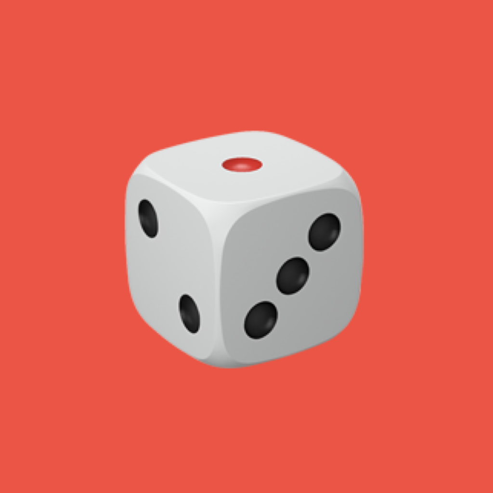

<!-- PROJECT LOGO -->
 

  

<h3 align="center">Dice Roll</h3>

  

    A simple dice roller app made with SwiftUI by an undergraduate student
     
  

<!-- ABOUT THE PROJECT -->
## About The Project

![Alt Text]

### Built With

* SwiftUI
* Core Data
* Combine

<!-- GETTING STARTED -->
## Getting Started

1) Enter XCode
2) Clone an existing project
3) Enter the repository url

<!-- ROADMAP -->
## Roadmap

- [ ] Adding dice with more sides (The roadblock is the dice images, the functionality is already implemented!)
- [ ] Showing modal view with dice representing result of each roll on long press

<!-- LICENSE -->
## License

Distributed under the MIT License. See `LICENSE.txt` for more information.

<!-- CONTACT -->
## Contact

Your Name - [@premepopulation](https://twitter.com/premepopulation) - andrewalmasi@gmail.com

Project Link: [https://github.com/arrrshia/DiceRoll](https://github.com/arrrshia/DiceRoll)

(<a href="#readme-top">back to top</a>)

